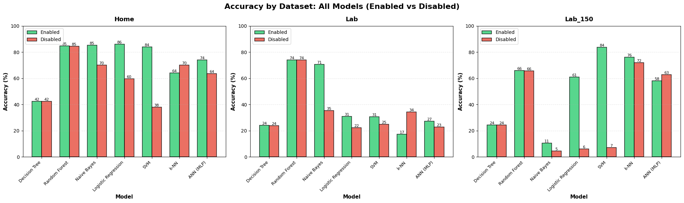
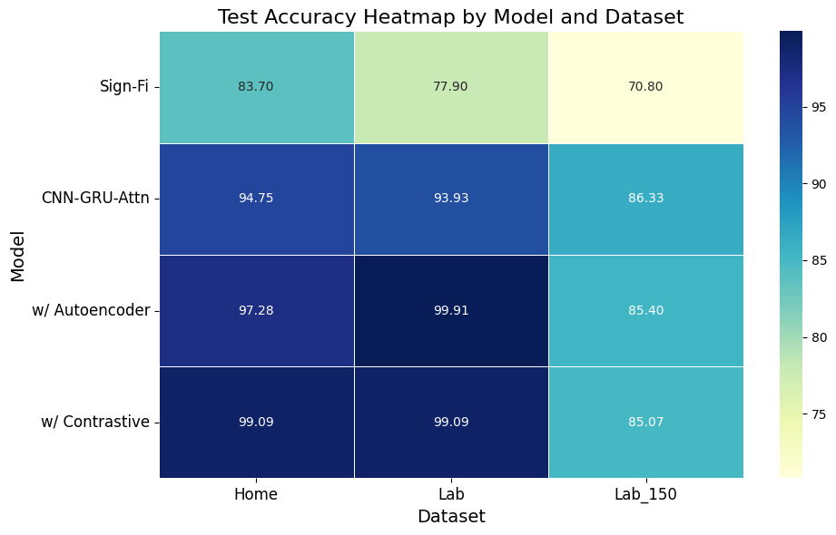

# CSI-Based Sign Language Recognition Using CNN-GRU Architecture Enhanced with Attention

This repository contains the implementation and experimental analysis of a **CSI-based sign language recognition system** using a hybrid **CNN–GRU architecture enhanced with multi-head attention**.  
The project was completed for **IECE 566: Deep Learning (Fall 2025)** at the **University at Albany, SUNY**.

---

## 📌 Project Overview

Camera-based sign language recognition raises privacy concerns and often requires controlled environments. This project explores WiFi **Channel State Information (CSI)** as a **device-free, privacy-preserving alternative** for recognizing fine-grained hand and arm gestures using deep learning.

CSI captures amplitude and phase variations across subcarriers and antennas, producing **high-dimensional spatio-temporal signals**. However, CSI data is noisy, user-dependent, and sensitive to environmental changes. This project investigates whether a **CNN–GRU–Attention architecture**, combined with **CSI-specific preprocessing, data augmentation, and self-supervised pretraining**, can achieve robust and generalizable sign language recognition.

**The study includes:**

- Hybrid CNN–GRU–Attention architecture for spatial–temporal modeling  
- CSI-specific preprocessing and amplitude–phase fusion  
- Comparison with classical ML baselines  
- Ablation studies to analyze architectural contributions  
- Self-supervised pretraining with data augmentation  
- Grad-CAM–based explainability for model interpretation  

---

## 📁 Repository Structure


```

├── Code/
│   ├── simple\_classifiers\_final.py       # Classical ML baselines
│   ├── cnn\_gru\_attention.py              # CNN-GRU-Attention model
│   ├── hyper-opt.py                      # Hyperparameter optimization
│   ├── ablation-study.py                 # Ablation experiments
│   ├── self-supervised-pretraining.py    # Pretraining with augmentation
│   ├── explainability.py                 # Grad-CAM analysis
│
├── Data/
│   └── Home/                            # Subset of the Home CSI dataset (for demonstration)
│
├── Results/
│   ├── plots/                           # All results plot
│
├── Deliverables/
│   ├── DL\\\_Project Report.pdf               # Final project report
│   ├── DL\_Project\\\_Overview.pdf             # Initial project proposal
│   └── Poster\\\_Joy.pdf                      # Project Presentation Slides
│
├── Materials/
│   ├── Sign Detection with CSI               # Sign-Fi dataset reference paper
│   └── FuseLoc.pdf                  # Paper used for phase pre-processing
│
└── README.md


```


---

## 🧠 Problem Formulation

The objective is to learn a mapping from CSI tensors to gesture labels by minimizing a **multi-class cross-entropy loss**:

$\min_{\theta} L(\theta) = \frac{1}{N} \sum_{i=1}^{N} \ell(x_i, y_i; \theta)$

Where each CSI sample $x_i$ is a tensor of shape **(200 × 60 × 3)** capturing temporal evolution, subcarrier variation, and multi-antenna spatial patterns.

  

CSI data is inherently noisy and high-dimensional, making **joint spatial–temporal modeling essential** for accurate gesture recognition.

---

## ⚙️ Methodology

### Key Components

- Moving-average filtering and **amplitude–phase fusion**  
- CNN blocks with BatchNorm, ReLU, SE blocks, pooling, and dropout  
- **Bidirectional GRU** layers for temporal modeling  
- **Multi-head attention** to emphasize informative time steps  
- Fully connected layers for final classification  

### Neural Network Architecture


- **Input:** CSI tensor (200 × 60 × 3)  
- **CNN** extracts spatial representations  
- **GRU** models temporal dependencies  
- **Attention** focuses on discriminative segments  
- **Softmax** output for gesture classification  

---

## 📊 Experimental Setup

### CSI Datasets

| Dataset | # Signs | Repetitions | # Instances |
| ------- | ------- | ----------- | ----------- |
| Home    | 276     | 10          | 2,760       |
| Lab     | 276     | 20          | 5,520       |
| Lab150  | 150     | 10          | 7,500       |

> ⚠️ Only a subset of the Home dataset is included in `Data/`. Lab150 introduces significant user and environmental variability.

### Training Configuration

- Batch size: 256  
- Optimizer: AdamW  
- Weight decay: $1 \times 10^{-4}$  
- Learning rate: $5 \times 10^{-4}$  
- Epochs: up to 150 with early stopping  
- Cosine annealing learning rate schedule  
- Label smoothing (ε = 0.1)  
- Gradient clipping (max norm = 1.0)  

---

## 📈 Results Summary

- CNN–GRU–Attention outperforms classical ML models  
- Accuracy: 94–95% on Home and Lab datasets  
- Pretraining with augmentation increases accuracy to ~99%  
- Maintains ~87% accuracy on Lab150 despite high variability  
- Attention improves temporal focus and interpretability  
- Pretraining improves convergence stability  

  

Detailed results, ablation studies, and Grad-CAM analyses are in the `Results/` directory and `Deliverables/` folder.

---

## ✅ Conclusions

- Joint CNN and GRU modeling is essential for CSI-based gesture recognition  
- Attention enhances temporal focus and interpretability  
- Classical ML models fail to generalize under user variability  
- Pretraining and augmentation significantly improve robustness  
- User diversity remains the primary limitation for real-world deployment  

---

## 📚 References

1. Yongsen Ma, Gang Zhou, Shuangquan Wang, Hongyang Zhao, and Woosub Jung. *Signfi: Sign language recognition using Wi-Fi.* Proc. ACM Interact. Mob. Wearable Ubiquitous Technol., 2(1), March 2018.  
2. T. F. Sanam and H. Godrich. *FuseLoc: A CCA Based Information Fusion for Indoor Localization Using CSI Phase and Amplitude of Wi-Fi Signals.* ICASSP 2019, Brighton, UK, pp. 7565–7569.  

---

## Project Status

✅ **Completed** — Baseline implementation  

🔧 **Open for enhancements and upgrades**

---

## Acknowledgements

The initial components, including CSI data preprocessing and baseline pipeline, were carried out during undergraduate research: [Undergrad Project Link](https://github.com/Joysaha189/Implementation-Friendly-CNN-For-Sign-Language-Recognition-Using-Wi-Fi-CSI-Data)

Special thanks to:

- **Dr. Hafiz Imtiaz** and **Dr. Tahsina Farah Sanam** for guidance  
- Dataset and baseline model based on **SignFi**: [https://yongsen.github.io/SignFi/](https://yongsen.github.io/SignFi/)  
- **Dr. Sourabh Sihag** for guidance and feedback  

---

## Author

**Joy Saha**  
Department of Electrical and Computer Engineering\
University at Albany, SUNY  


---

## License

This project is for **academic and educational purposes only**.


